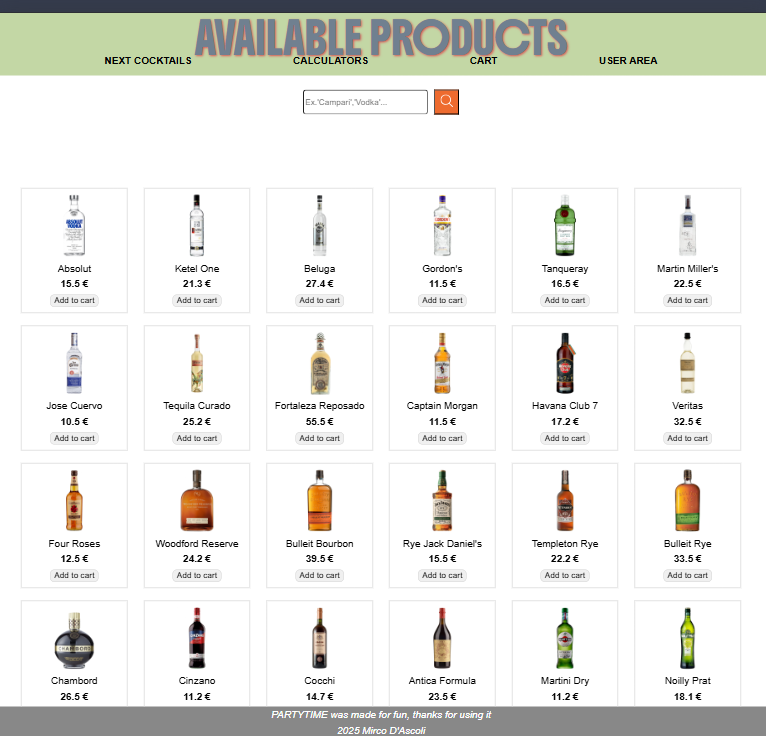

# PARTYTIME

PARTYTIME es una applicacion con calculadores para aumentar,
 la venta de licores de una tienda de licores en linea

## Tecnologias usadas
HTML, CSS, Javascript para el front end
Javascipt con Node.js e MONGO DB como base de datos
TypeScript : conceptos basicos para evitar errore de tipado
ESlint, Style lint para linteo
Lit para componentes web reutilizables
 

## Inicio y Selección de Cócteles

El usuario abre la aplicación y ve dos listas de cócteles:

Sabores intensos y fuertes

Sabores ligeros y refrescantes

Cada lista contiene 4 o 5 cócteles disponibles.

Los usuarios pueden desbloquear más cócteles suscribiéndose a Premium.

## Información del Cóctel

Al seleccionar un cóctel, el usuario accede a:

Receta base con proporciones estándar.

Historia del cóctel (origen, curiosidades).

Sugerencias (cómo servirlo, con qué maridar).

## Uso del Calculador de Prebatch

El usuario elige la cantidad total deseada de cóctel:

Mínimo: 180 ml

Máximo: 1800 ml

Sensibilidad: 10 ml (puede ajustar en incrementos de 10 ml)

Pulsa el botón CALCULA.

Cálculo de Ingredientes
La app muestra con precisión de 0.1 ml las cantidades exactas de cada ingrediente.

El botón CALCULA se transforma en AÑADIR AL CARRITO.

el calculador se transforma en una seleccion de licores para eligir la marca de licor

Agregado de Botellas al Carrito
Por cada 700 ml de producto, la app añade automáticamente al carrito una botella del licor correspondiente.

Se puede modificar la cantidad Y MARCAantes de la compra.

## Finalización de Compra

El usuario revisa su carrito y finaliza la compra.

Se genera un resumen con los productos y cantidades exactas.

la app sugiere otros licores o ingredientes complementarios.

La receta de los prebatch se queda en un historial donde el utente siempre puede revisar la receta o ir de nuevo a su calculador

## DEFINIR BASE DE DATOS

base de datos de licores con sus datos y precios

base de datos usuarios

base de datos cockteles y ingredientes
